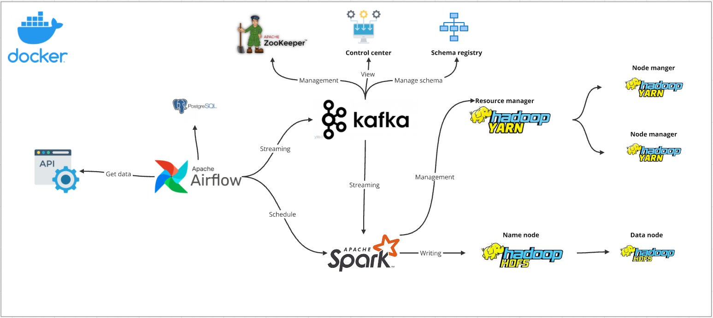

# Data Pipeline Architecture

## Overview
This project represents a data pipeline that integrates various big data technologies to ingest, process, and store streaming data efficiently. All of things is automated by **Airflow**. The architecture is containerized using **Docker** for easy deployment and scalability.

## Technologies
- **Python**
- **Apache Airflow**
- **Apache Kafka**
- **Apache Zookeeper**
- **Apache Spark**
- **PostgreSQL**
- **Docker**
- **Hadoop HDFS**

## Architecture Components
### 1. System Architecture

### 2. **Data Source**
I use **randomuser.me** API to generate random user data for my pipeline
### 3. **Data Ingestion**
- **Apache Airflow**: Orchestrates workflows, schedules jobs, and fetches data from an API.
- **PostgreSQL**: Stores metadata and logs for Airflow.

### 4. **Streaming & Messaging**
- **Apache Kafka**: Acts as the central event streaming platform.
- **Schema Registry**: Manages the schema of Kafka topics to ensure data consistency.
- **ZooKeeper**: Manages and coordinates Kafka brokers.

### 5. **Processing & Computation**
- **Apache Spark**: Consumes streaming data from Kafka for processing and transformations.
- **Apache Hadoop YARN**: Manages cluster resources for Spark.

### 6. **Storage**
- **Hadoop HDFS**: Stores processed data from Spark for further analytics.

## Data Flow
1. **Airflow** retrieves data from an external **API** and pushes it to **Kafka**.
2. **Kafka** streams the data for real-time processing.
3. **Spark** consumes Kafka topics and processes the data.
4. The processed data is written to **HDFS** for storage.
5. **Hadoop YARN** manages Spark jobs and resource allocation.

## Get started
The first time you can clone the repository:
```sh 
git clone https://github.com/tiennguyen2k4/Streaming-Pipeline-ETL
```
This project runs in a **Dockerized environment**. To start the services:
```sh
docker-compose up -d
```
